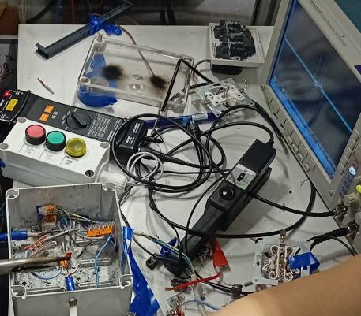
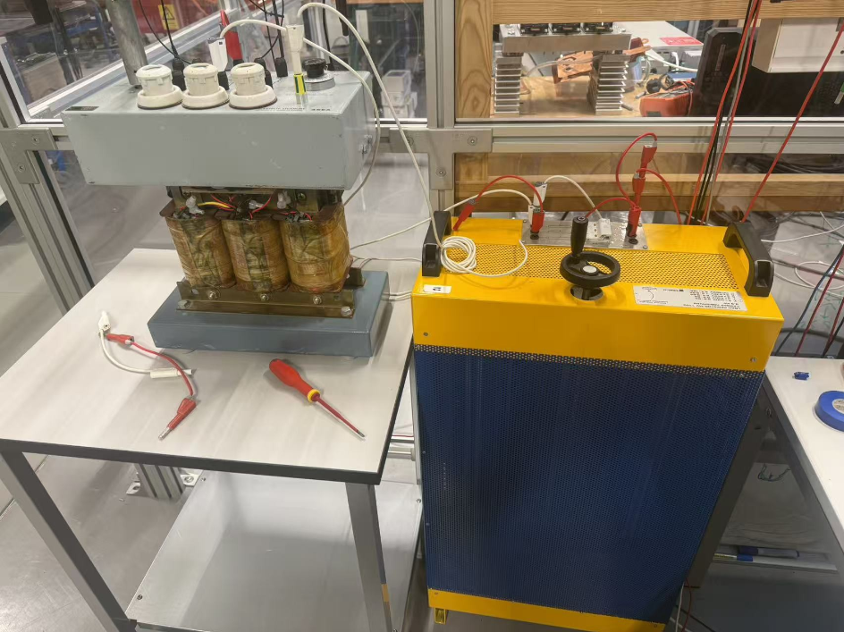

# Arc Fault Detection
This project is designed to work exclusively with DEEPCRAFT™ Studio. Download it from [here](https://softwaretools.infineon.com/assets/com.ifx.tb.tool.deepcraftstudio)

## Overview - Use-Case
Electrical fires are a common source of fires and have been [found to be responsible](#fire_citation) for 33.7% of all fire incidents in China between 2008 and 2012 and arc faults have been found to be responsible for 63.9% of all electrical fires in China during the same period.

This projecst aims to identify arc faults using an data captured with an oscilloscope to measure the current in an appliance. This project could be augmented with data from any oscilloscope if the output can be suitably downsampled to the same level (200kHz). The model could then be used in real-time arc fault detection.

- **Problem:** Real-time detection of arc faults 
- **ML Method:** CNN binary classification model  
- **Sensor & Data:** An oscilloscope with a hall-effect current probe with a rated bandwidth dc-100kHz. Data sampled at 50mHz and downsampled to 200kHz
- **Relevance:** This solution enables:
  - Rapid detection of arc faults using a convolutional neural network
  - Safer electronics operation with inbuilt arc fault monitoring

## Contents

`Data` - Contains downsampled 200kHz input data files

`Models` - Folder where the trained DEEPCRAFT model, predictions, and generated Edge code are saved

## Sensor(s) & Data

 **Oscilloscope** 
 
 

 **Load simulator**
 
 

 **Appliance:**: Various appliances were used including a drill, a router, 

### Data Specifications

The starting point of the data is taken from the source file at random. The time always starts at zero so as to prevent a spurious correlation between the arc/nonarc status and some extraneous details such as sample rate, time offset, etc.

The data was gathered by [KTH](#data_authors) and the original, untransformed data, scripts used to convert the data from the raw .isf format and other accompanying material may be found [here](https://gnu.eecs.kth.se/nt/tmp/y/) 

**Input Features (data.data):**
- `t` - Timestamp (seconds)
- `i` - Current as measured by an oscilloscope 

**Target Variable (label.label):**
- `Time` - Timestamp of the beginning of the label (seconds)
- `Length` - Length of the label (seconds)
- `Label` - The label of the data 1 - arc fault, 0 - no arc fault 
- `Comment` - Any comments relating to the sample

**Sampling:**
- Original sampling rate: 50 mHz
- Sampling rate of provided data: 200 kHz

**Files:**
- 1496 data files
- Format: CSV files (.data files) as input and label files (.label files) as targets presented in pairs.

### Important Measurement Scenarios

To ensure robust model performance, collect data covering:
- A wide array of devices
- Variable loads
- Transient conditions: startup, shutdown, load changes

## Steps to Production

### 1. Increase Data Variability

**Current Status:** Dataset includes 1496 samples from various appliances and simulated conditions recorded using an oscilloscope.

**To Improve:**-
- Collect data from **additional appliances** to account for device-to-device variations
- Simulate and collect data from **additional arc fault scenarios** to account for low positive to negative sample proportion

### 2. Robust Train/Test Split

**Current Approach:** Data is split into multiple parts for training.

**Production Requirements:**
- Ensure **Test set** contains data from:
  - Different measurement sessions than Train/Validation sets
  - Both negative and positive data

### 3. Increase Model Robustness

**Add Positive Cases:**
- The datasest contains many sessions where an arc fault does not occur, adding more data from appliances where an arc fault is induced would be beneficial. 

**Validation Strategy:**
- Test model on appliances not used in training
- Compare against traditional, algorithmic approaches.

### 4. Model Optimization for Edge Deployment
- Memory constraints: Optimize model size for embedded deployment
- Inference speed: Real-time arc fault prediction
- Power consumption: Efficient neural network inference
s
### 5. Safety and Validation

**Critical for Production:**
- Define a prediction accuracy threshold
- Validate against physical sensor during commissioning
- Define update strategy for model improvements
---

### 6. Citations
<a name="fire_citation">G. Si, “Analysis on china’s electrical fire situation and feature from 2008 to 2012,” Fire Science and Technology, vol. 33, no. 5, pp. 569–572, 2014. </a>

<a name="data_authors">N. Taylor, Y. Jiang, Kungliga Tekniska högskolan . </a>
