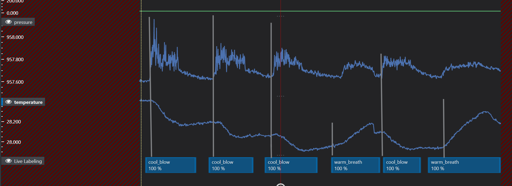
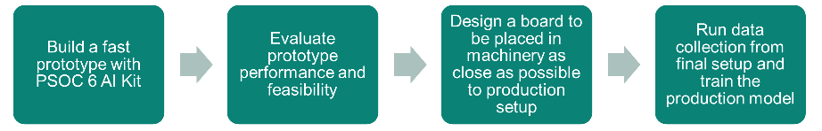
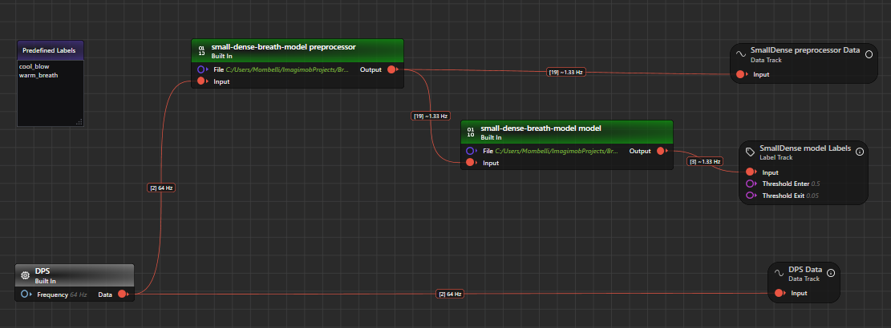
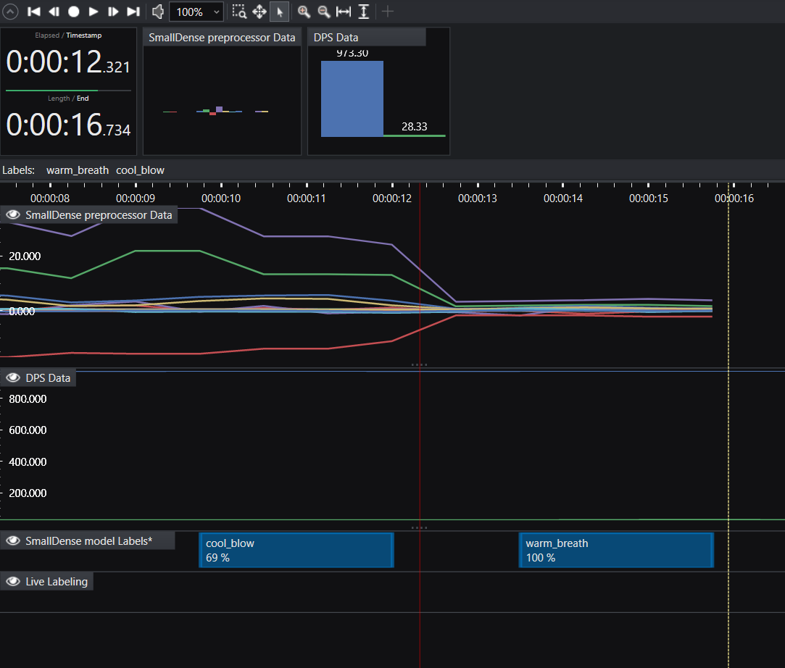
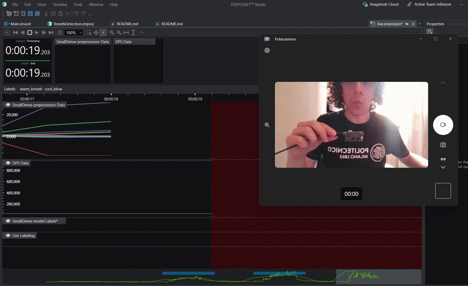

# Human Breath Detection AI (using XENSIV™ digital barometric air pressure sensor)

This project is designed to work exclusively with DEEPCRAFT™ Studio. Download it from [here](https://softwaretools.infineon.com/assets/com.ifx.tb.tool.deepcraftstudio)

## Use-case description:

This project demonstrates an AI model that classifies three states based solely on air-pressure and temperature dynamics at the sensor: cool_blow, warm_breath, and none. By learning the characteristic signatures of fast, focused airflow versus slow, warm exhalation, the model provides robust, on-device inference without external instrumentation, highlighting the precision and sensitivity of the XENSIV digital barometric pressure sensor (DPS) integrated with PSoC 6.

This project uses a XENSIV digital barometric air pressure sensor for breath-type differentiation. The goal is twofold: showcase the sensor’s capability to separate subtle human airflow modalities using only pressure and temperature, and inspire customers to envision practical applications where low-power, embedded ML can add real-time context awareness to compact devices.

### Value and potential applications:

Demonstration of sensor fidelity: This model underscores how the XENSIV DPS can resolve small, transient pressure deltas along with subtle temperature changes, enabling reliable classification of human airflow type on a resource-constrained microcontroller.
Human–device interaction: Natural, contactless triggers (e.g., blowing versus breathing) can augment user interfaces for toys, educational devices, or accessibility aids.
Situational awareness: In concept, multiple nodes could monitor breathing presence or type in constrained scenarios. For example, in mass-casualty incidents with limited personnel, an adapted version of this model could assist responders by flagging patients who appear to be exhaling versus showing no breath signal, helping prioritize attention.
Important note: This is not a medical device and is not intended for diagnosis or life-critical monitoring. Any emergency-use concept requires rigorous validation, certification, and safeguards before deployment.

### Operating instructions and tips:

Orientation: Ensure the sensor port is unobstructed and facing the user; avoid covering it with (warm) fingers.
Environment: Minimize background airflow (fans, HVAC vents, outdoor wind) and strictly avoid direct exposure to sunlight (it will heat up the sensor, causing wrong results).
Ensure sufficient cooling! The sensor heats up after prolonged use, please cool it regularly, e.g. with a paper fan.

### How to perform the class "cool_blow" (pursed lips):
Hold the device so the pressure/temperature sensor opening faces you.
Keep a distance of approximately 2-7 cm.
Purse your lips as if to whistle and blow cold(!) and steadily onto the sensor for a few seconds.
Avoid spitting; a strong, focused airstream is sufficient.

### How to perform the class "warm_breath" (open mouth):
Maintain the same 2-7 cm distance.
Open your mouth and gently breathe out onto the sensor for a few seconds, as if fogging a window or warming your hands. It should be a slower, warm exhale.
Do not blow forcefully.

## Contents

`Data` - Folder to put your data.

`Models` - Folder where trained models, their predictions, and generated Edge code are saved.

`Tools`    - Folder containing different tools; read the text below or the appropriate readme file.

`Tools\LiveDataCollection`- Folder with the Data Collection GraphUX project you can use for collecting additional data and expanding the dataset.

`Tools\LiveModelEvaluation`- Folder with the Data Collection GraphUX project you can use for evaluating models.

`Units` - Folder where custom layers and pre-processors can be added.

### Sensor settings specification

This starter project requires the [PSOC™ 6 AI Evaluation Kit](https://www.infineon.com/cms/en/product/evaluation-boards/cy8ckit-062s2-ai/). This platform is (among other things) equipped with the XENSIV™ digital barometric air pressure sensor. The board is designed for easy prototyping and lets you collect real-life data to easily build a compelling ML product fast.
For this project you do not need any other materials apart from the PSoC.

## Collecting and expanding the dataset

To add more data, you need to flash and configure the [Imagimob Streaming Protocol Firmware](https://github.com/Infineon/mtb-example-imagimob-streaming-protocol/blob/master/README.md) on your AI Kit.
Follow the instructions in the README.md file of the ModusToolbox project to correctly configure and flash the board.

For starting data collection, navigate to the `Tools\LiveDataCollection` folder and double-click the `Main.imunit` file.
Make sure you have correctly connected the PSOC6 AI Kit to your machine via the USB connector (use J2 for streaming).

In the GraphUX, you should now see the following simple project; The data stream of the built-in DPS, containing temperature and pressure data, is divided into two separate streams for individual visualization of pressure and temperature:

Click the white play/start button on the toolbar to execute the GraphUX pipeline. The live.imsession window will now open.
Then click onto the white circle to start recording. You will now see the XENSIV digital barometric pressure sensor (DPS) data, the temperature (single) and pressure (single).

Important: Typically, DEEPCRAFT scales both graphs accurately. If you are only seeing a straight line, you will need to adjust the scaling. To do so, click on the gray box with white text, which features a stylized eye icon. This will open a window on the right-hand side. In this window, you can configure the area you want to display graphically under the "Visual" and "Y Axis Zoom" menus. As a general rule, you will need to select a relatively narrow range compared to the overall range.

By clicking the "Record" button in the .imsession window, Now you should be able to record and visualize XENSIV digital barometric pressure sensor (DPS) data:

If needed, you can use the predefined "cool_blow" & "warm_breath" label to label the collected data.

Once you have completed data collection, you can save the sample in the `Data` folder or your preferred folder.

**Important**: Take care of saving only the combined data streams (DPS-Data.data). Models will process two data streams at the same time. Data streams are split with "Select" nodes in this project just for visualization purposes.

## A note on data labeling / Model output:

Note that Deepcraft Studio introduces an "Unlabelled data" class by default.

**cool_blow**: Indicates a fast, focused airstream typically associated with pursed lips; often characterized by a distinct pressure pulse with limited warming of the sensor.
**warm_breath**: Indicates a slower exhalation typical of open-mouth breathing; often characterized by a gentler pressure change and a temperature increase at the sensor.
**Unlabelled**: Indicates no significant airflow or temperature change consistent with breath-related events.

## Recommended path to production

To bring this project to a production-level system, follow these general steps:

The prototyping part is fundamental since it will allow you to state the feasibility of your task in a cheap and fast way. If you can get to a model able to reach satisfactory performance with a simple prototype, then you can be pretty confident that you'll be able to get a good result in production.

1. Define your target setup and real-world usage

Decide how the sensor will be used in the final device (distance to the user, enclosure/air path, orientation, typical ambient airflow and temperature).
Try to keep these conditions consistent during prototyping; even small changes can shift pressure/temperature dynamics.

2. Collect (or reuse) representative data

Use the provided template data as a baseline and record your own data in your intended environment to validate performance.
Ensure all three classes are covered with enough variation (different users, multiple sessions, slightly different distances).

3. Import your data and train the prototype model

Import the data you collected in the "Data" tab of the .improj file in Deepcraft Studio.
You are now able to follow the standard Deepcraft Studio steps for processing, training, and deploying your model.
The preprocessor is already set, and some models are already defined for you, which performance is guaranteed to be in real-time on the PSOC6 AI Kit.

4. Deploy and do a real-time test of your prototype model

Last thing to be done in prototyping phase is to deploy the firmware to the device by leveraging the template application already available in ModusToolbox: [MTB Example ML Imagimob MTBML Deploy](https://github.com/Infineon/mtb-example-ml-imagimob-mtbml-deploy) and test the firmware on the device. The UART terminal will show you real-time predictions.
For live testing in Deepcraft Studio, you can also use the evaluation project in `Tools\LiveModelEvaluation`.

5. Going to the production board system

The final production setup will likely differ from the prototype and can affect pressure/temperature dynamics.
If anything relevant changes, collect a small production-representative dataset and repeat steps 2–4 (or fine-tune via transfer learning) to match the final integration.
For more advanced development, you can use the feature-extraction tooling provided in the Tools folder (explained in the respective subfolder).

You may also leverage Deepcraft Studio's Transfer Learning features for fine-tuning the prototype model to production data. This could lead to better results and faster go-to-production times, but the usage of Transfer Learning is recommended only to experienced ML users.

## Evaluating your final AI Modell using DEEPCRAFT Studio
You can test your ML model as usual using the PSoC, or run it directly on your PC with Deepcraft. To improve this workflow, you will find a project for evaluating your AI model in the `Tools\LiveModelEvaluation` folder. Open it by clicking the `Main.imunit` file. You will be prompted with a GraphUX interface showing the data flow:

Click on the "Play" button in the toolbar, and when the live.imsession tab opens, click on the "Start Recording" button to start collecting data.

Wait until you see some data appearing in `Preprocessed Data` data track, and then perform some cool blow or warm breath in the way explained above. You can observe the model making predictions in real time:

## Getting Started

Please visit [developer.imagimob.com](https://developer.imagimob.com), where you can read about Imagimob Studio and go through step-by-step tutorials to get you quickly started.

## Help & Support

If you need support or if you want to know how to deploy the model on to the device, please submit a ticket on the Infineon [community forum ](https://community.infineon.com/t5/Imagimob/bd-p/Imagimob/page/1) Imagimob Studio page.