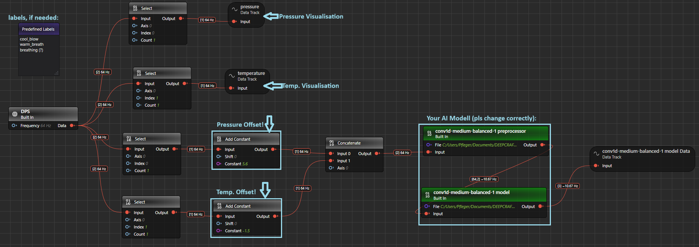

# Advanced Feature Extraction

## Overview
For experienced users and ML experts, we provide two Jupyter Notebooks that enable advanced data analysis and feature extraction from the recorded pressure and temperature data. These notebooks allow you to:

- Normalize the data (e.g., 0-1 scaling);
- Apply filtering techniques (high-pass, low-pass);
- Generate signal envelopes;
- Adjust offsets;
- Perform detailed statistical analysis.

Use these tools to dive deeper into your data, explore additional signal characteristics, and optimize your ML model for the best performance on the PSoC 6 AI Kit. These notebooks are designed for advanced users who want to explore the full potential of the sensor data and customize their approach.

The Jupyter notebook serves as a advanced tool for this project and not necessary by default.

For more Information please read the main README file.

### Getting Started

Please visit [developer.imagimob.com](https://developer.imagimob.com), where you can read about Imagimob Studio and go through step-by-step tutorials to get you quickly started.

### Help & Support

If you need support or if you want to know how to deploy the model on to the device, please submit a ticket on the Infineon [community forum ](https://community.infineon.com/t5/Imagimob/bd-p/Imagimob/page/1) Imagimob Studio page.