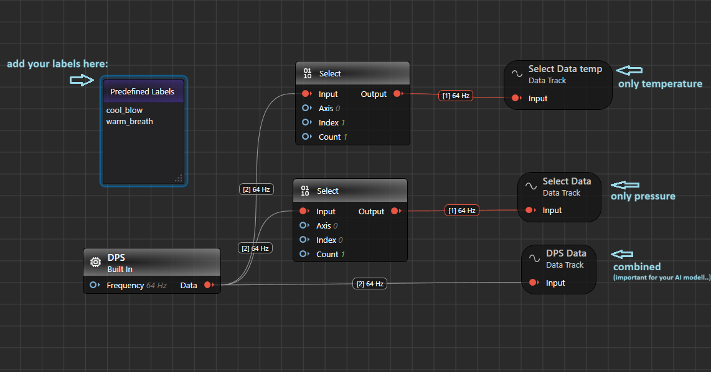

# Live Data Collection

## Overview

This project shows you how to collect and annotate data live. This can be done from external edge devices attached over USB-serial. 

The graph that you see in the Main.imunit contains input/data source nodes representing the PSoC's DPS Sensor.

## Collecting and expanding the dataset

To add more data, you need to flash and configure the [Imagimob Streaming Protocol Firmware](https://github.com/Infineon/mtb-example-imagimob-streaming-protocol/blob/master/README.md) on your AI Kit.
Follow the instructions in the README.md file of the ModusToolbox project to correctly configure and flash the board.

Make sure you have correctly connected the PSOC6 AI Kit to your machine via the USB connector (use J2 for streaming).

In the GraphUX, you should now see the following simple project; The data stream of the built-in DPS, containing temperature and pressure data, is divided into two separate streams for individual visualization of pressure and temperatur.

Click the white play/start button on the toolbar to execute the GraphUX pipeline. The live.imsession window will now open.
Then click onto the white circle to start recording. You will now see the XENSIV digital barometric pressure sensor (DPS) data, the temperature (single) and pressure (single).

Important: Typically, DEEPCRAFT scales both graphs accurately. If you are only seeing a straight line, you will need to adjust the scaling. To do so, click on the gray box with white text, which features a stylized eye icon. This will open a window on the right-hand side. In this window, you can configure the area you want to display graphically under the "Visual" and "Y Axis Zoom" menus. As a general rule, you will need to select a relatively narrow range compared to the overall range.

By clicking the "Record" button in the .imsession window, Now you should be able to record and visualize XENSIV digital barometric pressure sensor (DPS) data.

If needed, you can use the predefined "cool_blow" & "warm_breath" label to label the collected data.

**Important**: Take care of saving only the combined data streams (DPS-Data.data). Models will process two data streams at the same time. Data streams are split with "Select" nodes in this project just for visualization purposes.