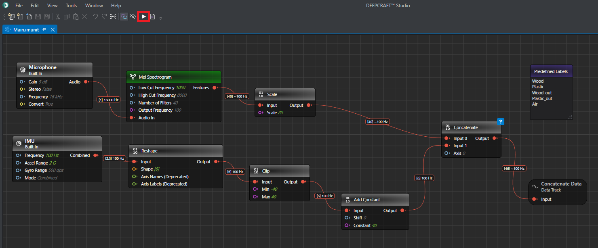
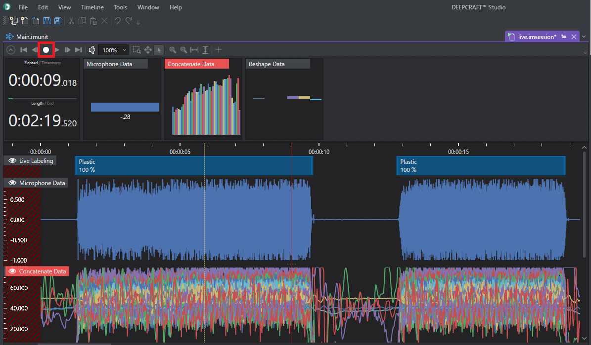
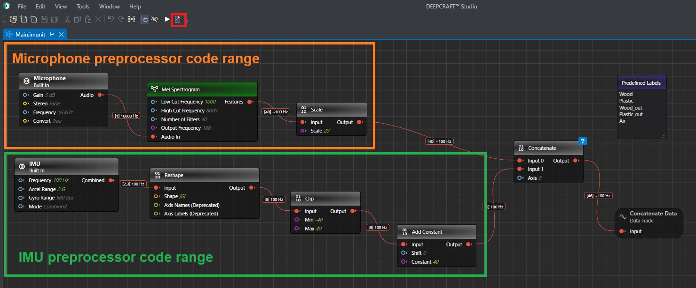
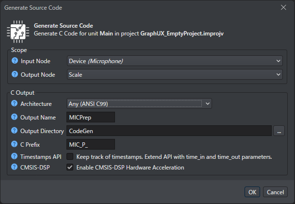
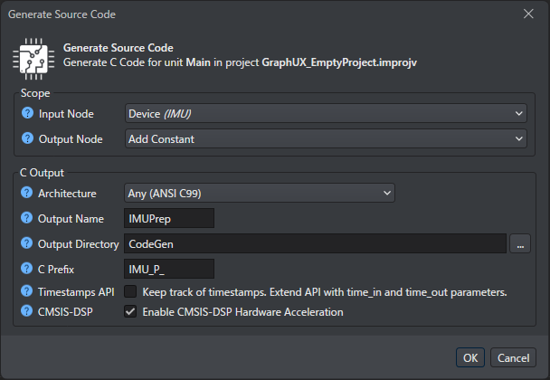

# Live Data Collection

## Overview

This starter project shows you how to collect and annotate MEMS Microphone & IMU data live. This can be done directly from your PSOC™ Edge AI Kit attached over USB-serial. 

The graph that you see in the Main.imunit contains input/data source nodes representing the device connected through the serial port.

## Concepts 

By opening the Main.imunit file you will see the graph which constitutes this data collection project.
In this graph there is the serial port as data source.

There is also an output data track node in the graph, connected to the data source. This node will generate the data so that it can be saved and visualized.

There is also a 'Predefined Labels' node. The labels that are entered into this node will appear as label buttons/short cuts when running the graph to record data.

When running this graph you will get a session visualizing the MEMS Microphone and the IMU data, containing a label track and label buttons which are used to label the data while recording.

After recording, you can save the session to disk, to be used for later model training or evaluation.

## Trying it out

1. Open the Main.imunit file from the Solution Explorer.
2. Click the start-button (the play symbol) in the Main.imunit tab

3. Wait for the session to open 
4. Press the record button to start recording

5. Record the data you want your model to classify and label it while doing so using the label buttons 
6. Save the recording to disk using ctrl+s or the Save button

## Generation of preprocessing code
When deploying a trained model to an MCU, you must deploy the preprocessing alongside the model.
The preprocessing is defined as a graph within this data collection project, and code can be generated from the graph. However, when using multiple sensors (sensor fusion), data synchronization between sensors is required. Currently, DEEPCRAFT™ Studio cannot generate code for the synchronization portion from the graph. Therefore, when deploying to the MCU, you must generate separate preprocessing code for each sensor and manually implement the synchronization logic within the MCU-side project.
This section explains how to generate separate preprocessing code for each sensor.
For the synchronization logic, refer to the MCU-side project.

### Generation of Preprocessing Code for MEMS Microphones

**1. Click the “Generate Source Code” button to the right of the “Start” button on the toolbar.**

**2. The “Generate Source Code” dialog will appear. Configure it as follows.**

**3. Click “OK”.**

### Generation of Preprocessing Code for IMU

**1. Click the “Generate Source Code” button to the right of the “Start” button on the toolbar.**

**2. The “Generate Source Code” dialog will appear. Configure it as follows.**

**3. Click “OK”.**

## Getting Started

Please visit [developer.imagimob.com](https://developer.imagimob.com), where you can read about DEEPCRAFT™ Studio and go through step-by-step tutorials to get you quickly started.

## Help & Support

If you need support or if you want to know how to deploy the model on to the device, please submit a ticket on the Infineon [community forum ](https://community.infineon.com/t5/Imagimob/bd-p/Imagimob/page/1) DEEPCRAFT™ Studio page.
