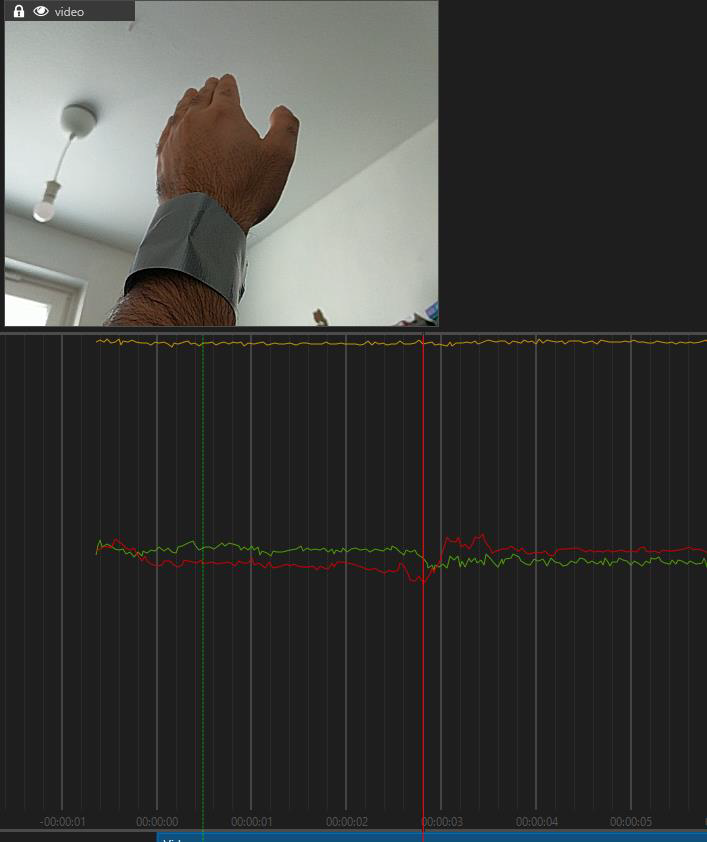
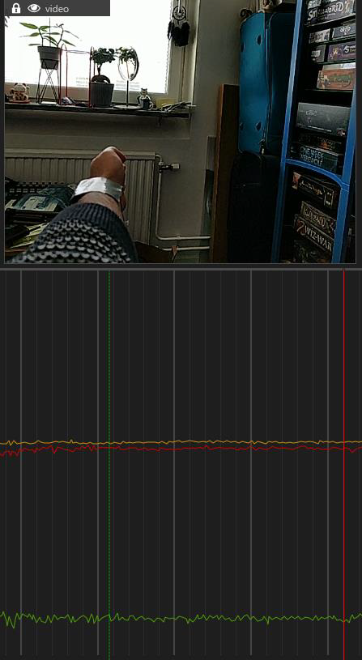
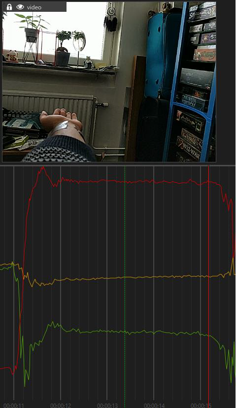

# Fall Detection (Wrist-worn)

## Overview - Use-Case

This project allows you to build models that detect falls in less active individuals, such as elderly people, using a 3-axis accelerometer worn on the wrist. It uses Classification to distinguish a fall from everyday activity, and pairs the model with a stillness-based post-processing gate that confirms a fall after a period of inactivity, reducing false positives.

Reliable wrist-worn fall detection is relevant to wearables, safety monitoring, and healthcare products aimed at helping less active or elderly users get timely assistance after a fall.

## Contents

`Data` - Folder where data is located. Contains wrist-worn accelerometer recordings organized by anonymized source, batch, class (Fall / NonFall), and session.

`Models` - Folder where trained models, their predictions and generated Edge code are saved.

`Tools` - Folder containing the `CodeGenGraphUX` Graph UX project used for code generation, including feature extraction and the stillness-based post-processing gate. The custom units (`Tools/CodeGenGraphUX/Units`) live inside this Graph UX project rather than a top-level `Units` folder, since Graph UX resolves unit paths relative to its own project.

## Sensor configuration

The accelerometer needs to be set up to collect data at 50 Hz, using a +/- 8g scale with 12- or 16-bit resolution. Input values must be expressed in g.

To correctly set up the IMU orientation, make sure that the accelerometer X, Y, Z axis and values are as shown in the figures below:
- Figure 1: Y = 1, X, Z = 0 --- hand held up  

  
- Figure 2: X = -1, Y, Z = 0 --- hand outstretched, palm facing front  

- Figure 3: Z = 1, X, Y = 0 --- hand outstretched, palm up  

## Data

The provided data consists of wrist-worn accelerometer recordings of simulated falls and everyday non-fall activities collected by Imagimob AB and project partners. Dataset identities and session identifiers have been anonymized. Data is licensed under the [DEEPCRAFT™ Studio Terms and Conditions](https://developer.imagimob.com/legal/studio-terms-and-conditions).

An advanced preprocessing layer called **Master Feature** is available as an alternative to the default low pass filter. It transforms each three-axis accelerometer sample into a configurable feature vector with the following features:

- **Force:** The magnitude of the acceleration vector, representing overall acceleration strength.
- **Dimension:** The magnitude of the change in acceleration since the preceding sample, representing sudden motion.
- **Rotation:** The combined change in acceleration direction across the three axes, representing wrist rotation.
- **Crossing:** A smoothed measure of accelerometer zero crossings, representing changes in motion direction.
- **Chaos:** A short-window L-kurtosis-based score, representing the irregularity of recent movement.
- **Sampling:** Low-pass-filtered X, Y, and Z accelerometer samples.

Using Master Feature can improve model performance. To switch to Master Feature layer:

1. Double-click the project file (`.improj`). The project file opens in a new tab.
2. Click **Preprocessor** tab on the left pane.
3. Click **+** (Add New Layer) to add custom layer, Master Feature.
4. Click **-** (Delete Layer) to delete the Low Pass Filter layer.

## CodeGenGraphUX

The included Graph UX project contains a disabled placeholder model. To use your trained model, replace it by following these steps:

1. Open `CodeGenGraphUX/Main.imunit` in **DEEPCRAFT™ Studio**.
2. Drag your trained model (`.h5` file from `Models/`) into the Graph UX project.
3. Delete the existing disabled model node.
4. Connect the **Sample Rate** node output to the input of the new model's preprocessor.
5. Connect the new model's output to the **Gate** node.

## Adding More Data

To collect more data you can utilize the PSOC™ 6 AI Evaluation Kit and the [streaming protocol](https://developer.imagimob.com/data-preparation/data-collection/collect-data-using-graph-ux) to stream data directly into DEEPCRAFT™ Studio and add it to this project.

New sessions can be labeled directly in Studio, using either manual labeling or model-assisted labeling.

## Steps to Production

To take this project to production you should do the following:

- Increase data variability: add data from different age groups, fall types, environments, and devices.
- Add negative data of people going about their everyday lives (walking, running, sitting, sports, etc.) to increase model robustness and teach the model what is not a fall.
- Make sure the Test set contains data not used in Train and Validation, so you can verify the model generalizes to different wearers and scenarios.
- Validate sensor orientation against the coordinate system used during data collection; incorrect axis orientation can reduce model performance.

## Getting Started

Please visit [developer.imagimob.com](https://developer.imagimob.com), where you can read about Imagimob Studio and go through step-by-step tutorials to get you quickly started.

## Help & Support

If you need support or if you want to know how to deploy the model on to the device, please submit a ticket on the Infineon [community forum ](https://community.infineon.com/t5/Imagimob/bd-p/Imagimob/page/1) Imagimob Studio page.
