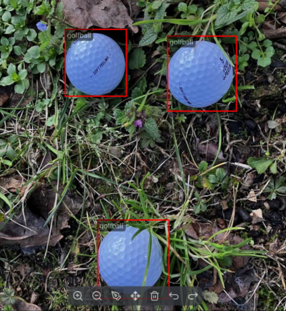

# Golf Ball Detection — DEEPCRAFT™ Studio Accelerator

This project is designed to work exclusively with DEEPCRAFT™ Studio. Download it from [here](https://softwaretools.infineon.com/assets/com.ifx.tb.tool.deepcraftstudio).

## Use-case description

This Studio Accelerator provides guidance on building a Computer Vision project for **golf ball detection** using an RGB camera.

The task is framed as an **object detection** problem: a Computer Vision task that classifies objects and locates them within an image. This project uses a single class: `golfball`.

### How can I know if this project fits my use case?

You can use this project if:

- You need to build a Computer Vision system for detecting or counting golf balls on grass fields.
- You can collect additional data, either in the real world or in simulated virtual environments.

If you cannot collect enough data, this project may not deliver accurate results.

### How can this project ease my go-to-production journey?

This project demonstrates how to approach the task from a Computer Vision perspective. Starting from this Accelerator, you get:

- A ready-made framework for object detection (YOLO-based).
- Sample data that is already collected and ready to use.
- Preconfigured data augmentation and model training parameters.
- A straightforward pipeline for collecting or importing more data as needed.

## Contents

- **`Data`** — Folder for your datasets. `Data\golf-ball-public` contains a public dataset; `Data\infineon-public` contains additional data collected by the Infineon team.
- **`Models`** — Folder where trained models, their predictions, and generated edge code are stored.
- **`Resources`** — Project resources, including images and documentation.

## Sensor(s) and Data

This accelerator is based on RGB images of golf balls from two sources: a public dataset from Roboflow (`Data\golf-ball-public`) and a dataset collected at Infineon (`Data\infineon-public`).

## Adding More Data

You can add data in two ways:

1. **Live collection in DEEPCRAFT™ Studio** — Use the built-in Computer Vision workflow: [Real-time image collection and labeling using a camera](https://developer.imagimob.com/deepcraft-studio/data-preparation/data-collection/collect-data-without-kit/collect-image-data-using-graph-ux).
2. **External import** — Bring in images collected on the field with a mobile phone or any other camera. See [Bring your own data for object detection projects](https://developer.imagimob.com/deepcraft-studio/data-preparation/bring-your-data/bring-your-own-data-object-detection).

For data collection and model deployment, we recommend the [PSOC™ EDGE Evaluation Kit](https://www.infineon.com/evaluation-board/kit-pse84-eval). This platform includes a PSOC™ Edge E84 MCU and a USB camera module. It is designed for rapid prototyping and lets you collect real-world data to build an ML product quickly.

Having physical golf balls on hand is optional, but you may need them to test the model and collect additional data. To try the project out of the box, you can also point the camera at pictures of golf balls on a laptop or phone screen.

**Hint:** If you collect data with a mobile phone or another camera, configure it to capture square images. This makes later processing easier and helps avoid unwanted stretching.

## Steps to Production

To bring this project to a production-level system, follow these general steps:

**1. Identify the target environment**

Define where and how the model will operate:

- Will the camera be fixed, mounted on a robot, or moved manually?
- Will it monitor grass fields, sand traps, or indoor environments?
- Will the golf balls be uniform, or will they vary in color and texture?

**2. Collect data for a prototype**

Collect a representative dataset in conditions as close as possible to the final setup. This helps the model adapt to specific angles, lighting, and scene details.

If detection accuracy is low or the model produces false positives, add **negative examples** (scenes without golf balls) to improve performance.

**3. Import your data and train the prototype model**

Import the data you collected into DEEPCRAFT Studio, then follow the standard workflow for processing, training, and deploying your Computer Vision model.

**4. Deploy and test the prototype in real time**

After training, deploy the model to your board using the ModusToolbox™ template application. Follow [Deploy Vision Model on PSOC™ Edge Boards](https://developer.imagimob.com/deepcraft-studio/deployment/deploy-models-supported-boards/deploy-vision-model-PSOC-Edge) for step-by-step instructions. Flash the firmware, then run a live test: the on-device display draws bounding boxes around detected golf balls so you can check accuracy, latency, and stability before moving to production hardware.

**5. Move to the production hardware**

Last step is to move to the actual final production setup. The production system will likely have the camera placed on a specific place on the final setup, not necessarly the same one of the prorotyping phase. If you can go as close as possible to production conditions during prototyping phase, you will be able to deliver the same model also on the production board with little-to-no additional training or data needed. If this is not the case, you might need to do a new data collection step to allow the model to learn the nuances of the final setup. Follow again steps 2, 3 and 4 also for the production setup to reach a functioning application.

**Note:** Monitoring and maintaining the ML system over its lifetime (drift detection, retraining, and so on) is your responsibility and should be defined according to your needs, requirements, and targets.

## Attributions and Citations

@misc{ golfball-pedge-detector, title = { GolfBall Dataset }, type = { Open Source Dataset }, author = { lolepls }, howpublished = { \url{ https://app.roboflow.com/lolepls/golf-ball-raahi-k2ygw/2 } }, url = { https://app.roboflow.com/lolepls/golf-ball-raahi-k2ygw/2 }, journal = { Roboflow Universe }, publisher = { Roboflow }, year = { 2026 }, month = { jan }, note = { visited on 2026-02-09 }, }

