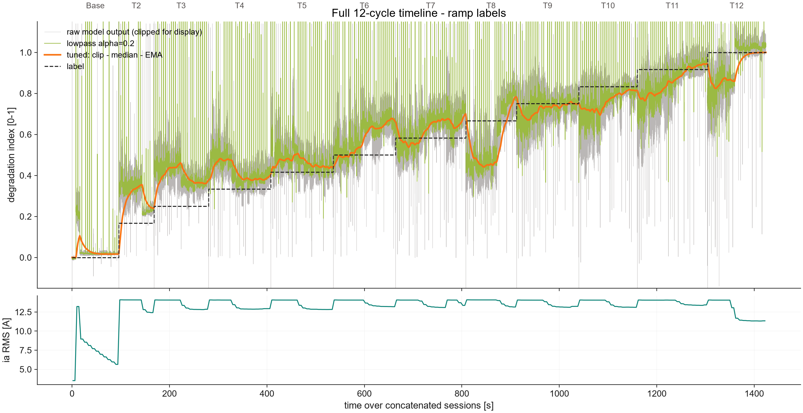
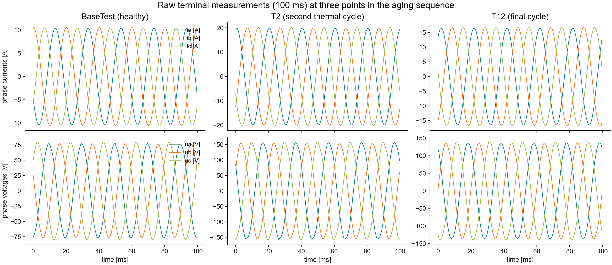
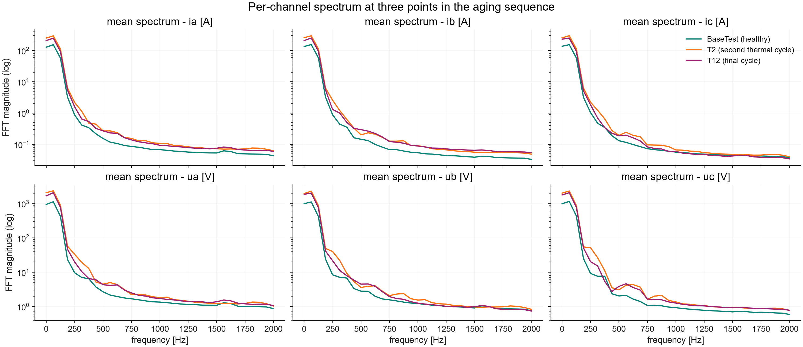
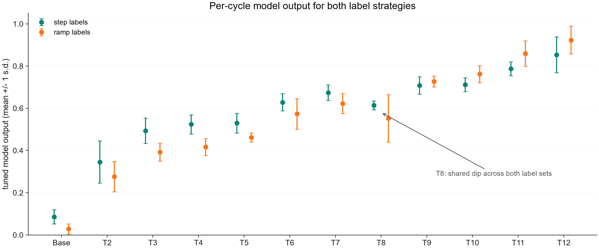

# Motor Degradation Estimation

A DEEPCRAFT Studio **regression** project that estimates the degradation state
(0 = healthy, 1 = failure) of an induction motor from its electrical signals —
three phase currents and three phase voltages — with no additional sensors.

## Use case

Insulation aging can be a cause of induction-motor failure and is invisible
to simple amplitude monitoring: the current envelope tracks *load*, not
*health*. This project shows that a small Conv1D+LSTM regression model on FFT
features of the electrical signals can track degradation continuously over the
machine's whole life, enabling remaining-useful-life estimation on low-cost
edge hardware that only taps the motor terminals, thus eliminating the need for additional sensors.

## Data

An 11 kW induction motor was thermally overloaded during working hours and
rested overnight — one thermal cycle per day — until insulation failure after
12 cycles.

- 356 sessions of ~4 s each: 6 channels (`ia, ib, ic, ua, ub, uc`) at 4 kHz.
- Day tags: `BaseTest` (healthy reference) and `T2`…`T12` (aging cycles).
- Regression target (`label.csv`, one value per sample): degradation =
  thermal_cycle / 12, so `BaseTest` = 0.0 and `T12` = 1.0 (failure).
- Pre-assigned datasets: 214 train / 70 validation / 73 test, stratified per
  day so every degradation stage appears in every set. The test set includes
  `Data/FullTimeline/Base_T2_T6_T12`, a concatenated 4-day sampler for
  reviewing predictions over the machine's life.

Raw waveforms barely change from the first overload day to the failure day —
the information lives in the harmonics:

## Preprocessing

Sliding window [64, 6] (stride 60) → Hann → real FFT (window axis) →
Frobenius norm → **[33, 6]** feature frame (33 frequency bins x 6 channels,
one frame per 15 ms). Degradation appears as a broadband redistribution of
harmonic energy:

## Model

Use the model wizard (*Generate Model List*) — the ModelFactory is
pre-configured to generate suitable candidates:

- Family **Conv1DLSTM**, flavor **SmallKern**, Dense regression head
- Loss **MeanSquaredError**, batch 32, up to 100 epochs, patience 15

This family matches the architecture validated on this data (two kernel-3
Conv1D layers → two small LSTMs → Dense head, ~5k parameters).

## Results

The reference model tracks the machine's aging monotonically across all 12
cycles (Pearson r ≈ 0.95 vs labels after smoothing; 10 of 11 day-over-day
transitions increase):

## Post-processing

The raw per-window output is noisy, with occasional spikes outside [0, 1].
Deployments should smooth it in application code (custom pipeline units are
not part of this project):

1. Clip to [0, 1].
2. Exponential lowpass `y[i] = alpha * x[i] + (1 - alpha) * y[i-1]` with
   `alpha = 0.2`, optionally preceded by a short median filter (~2 s) to
   reject spike outliers.

Degradation evolves over days, so aggressive smoothing costs nothing in
responsiveness.

## Limitations

- The labels are proxies derived from the thermal-cycle schedule - not from a
  measured insulation state.
- The data comes from a single machine and a single accelerated-aging run;
  domain adaptation work is to be expected before transferring to other motors.
